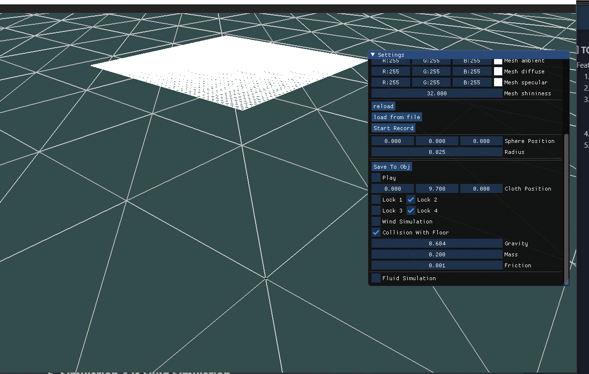
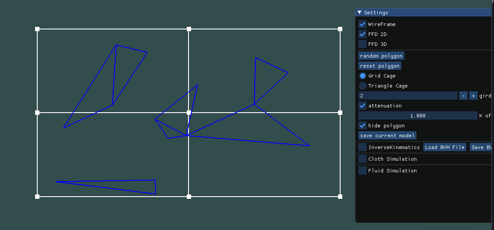
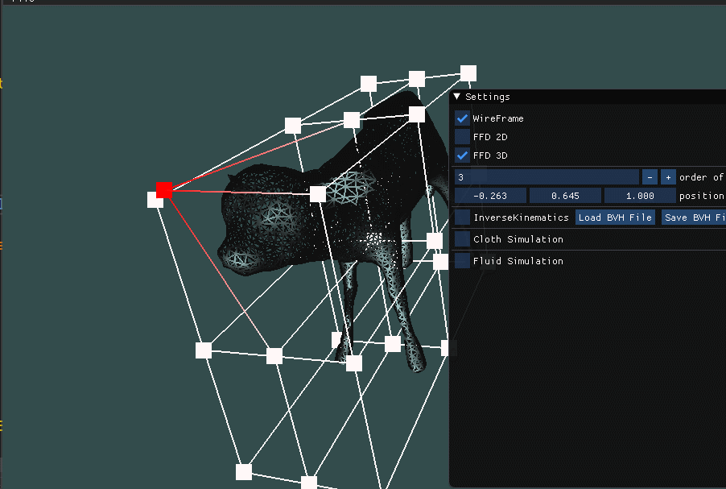
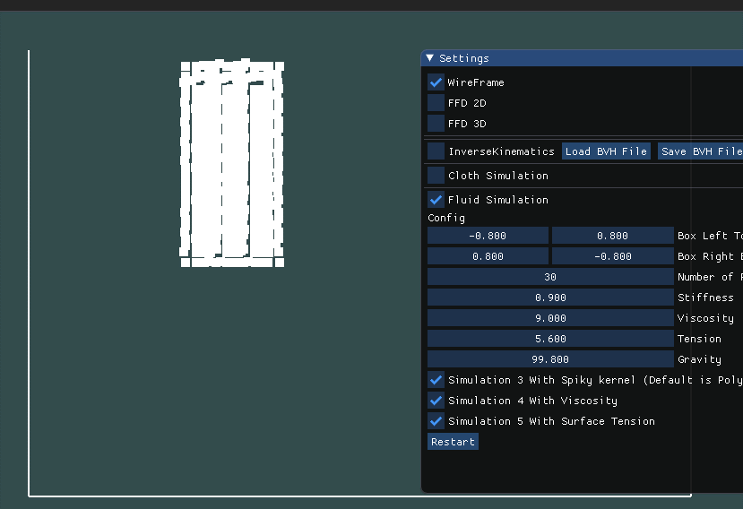
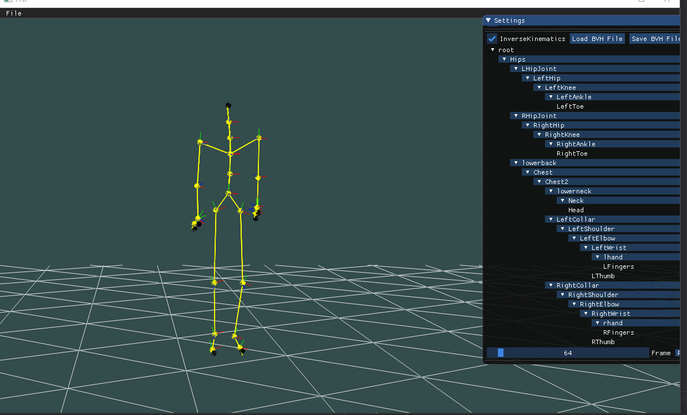

# Description 

This project is my <Animation and Simulation> courseworks, which include 4 assginments

* 1. FFD (Free-Form Deformation)
* 2. Fluid Simulation
* 3. Skeleton Animation and Inverse Kinematics 
* 4. Cloth Simulation

# How to Build

the project build with cmake system and cmake has put in vendor folder

to run gen_build_win.bat can get the sln file for visual studio.

the third libraries are glfw glew glm imgui and delaunator bvhlib opencv

Resources folder is the running folder and assets folder

Source code exists in app/src 

Core code exist in app/src/model folder

# Screenshots

